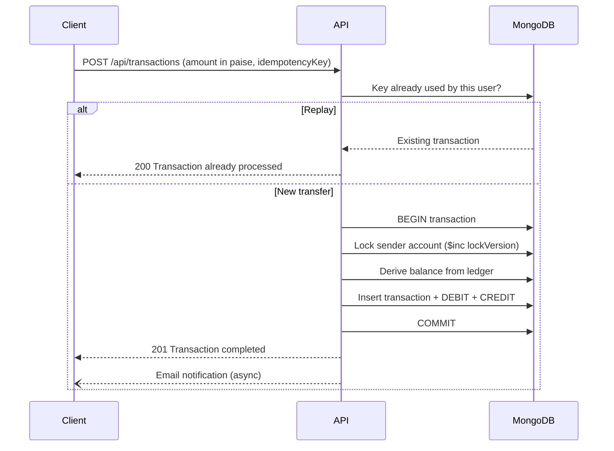

# Ledger: Double-Entry Banking System

A full-stack money-transfer application built on a **double-entry ledger**. Every transfer writes a matching DEBIT and CREDIT, balances are derived from immutable ledger entries (never stored), and transfers are atomic, idempotent, and safe under concurrent requests.

**Live demo:** https://fullstack-ledger-system.onrender.com

| Demo login | |
|---|---|
| Email | `demo@ledger.com` |
| Password | `demo1234` |

> Hosted on Render's free tier: the first request after ~15 minutes of inactivity can take up to a minute while the server wakes up.

---

## Screenshots

| Dashboard | Transfer |
|---|---|
|  |  |

---

## Features

- **User accounts:** register, log in, log out; open up to 5 accounts per user
- **Transfers** between any two active accounts, with a receipt for every transaction
- **Balances derived from the ledger:** computed by aggregating immutable DEBIT/CREDIT entries
- **System funding:** a privileged system user issues initial funds (the only way money enters the ledger)
- **Email notifications** for registration and successful transfers (Gmail OAuth2)
- **Safe retries:** resubmitting a transfer after a network error never moves money twice

## Tech Stack

| Layer | Technology |
|---|---|
| Frontend | React 19, React Router 7, Vite |
| Backend | Node.js, Express 5 |
| Database | MongoDB Atlas, Mongoose (multi-document ACID transactions) |
| Auth | JWT in httpOnly cookies, bcrypt password hashing |
| Security | Helmet, express-rate-limit, Mongoose `sanitizeFilter` |
| Email | Nodemailer with Gmail OAuth2 |
| Hosting | Render (single service: Express serves the React build) |

---

## Design Decisions

### 1. Double-entry ledger with derived balances

Accounts don't have a `balance` field. Every transfer creates one `transaction` record and two `ledger` entries: a DEBIT on the sender and a CREDIT on the receiver. A balance is the sum of an account's credits minus its debits.

Ledger entries are **immutable**: Mongoose pre-hooks reject every update and delete operation. The full history is always auditable, and the balance can never drift out of sync with it.

### 2. Money stored as integer paise

Floating-point numbers can't represent money exactly (`0.1 + 0.2 === 0.30000000000000004`), and sums over many entries drift. All amounts are stored and transmitted as **whole paise** (₹10.50 → `1050`), validated with `Number.isInteger` at both the API and schema level. The frontend converts to rupees only for display.

### 3. Atomic transfers

Each transfer runs inside a MongoDB multi-document transaction via `session.withTransaction()`. The transaction record and both ledger entries are committed together or not at all. `withTransaction` also retries automatically on transient errors such as write conflicts.

### 4. Preventing double spending under concurrency

Reading a balance inside a transaction isn't enough on its own. Two concurrent transfers from the same account can both read the same balance from their snapshots, both pass the check, and both insert *new* ledger documents. Since neither writes a document the other touched, MongoDB sees no conflict, and the account is overdrawn. This is a **write-skew** race.

**Fix:** each transfer first increments a `lockVersion` field on the sender's account document. Concurrent transfers from the same account now write the same document, MongoDB raises a write conflict, and `withTransaction` retries the loser, which re-reads the balance and is correctly rejected.

```js
// Serialises transfers from the same account
const from = await accountModel.findOneAndUpdate(
    { _id: fromAccountId, user: userId },
    { $inc: { lockVersion: 1 } },
    { session, returnDocument: "after" }
)
```

**Verified with a concurrency test** (`scripts/race-test.mjs`), which fires 5 simultaneous transfers, each for 60% of the balance, so at most one should succeed:

| | Successful transfers | Final balance |
|---|---|---|
| Without the lock | 4 of 5 | **-20 paise** (overdrawn) ❌ |
| With the lock | 1 of 5 | 12 paise ✅ |


### 5. Idempotency keys

The client generates a UUID per transfer *intent* and sends it with the request. The key is **unique per user** (compound index on `initiatedBy + idempotencyKey`), so:

- a retry with the same key returns the original transaction instead of creating a new one;
- two identical requests racing each other are resolved by the unique index, and the loser returns the winner's result;
- reusing a key for a *different* transfer is rejected with `409 Conflict`.

### 6. Authentication and security

- JWT stored in an **httpOnly, SameSite=Strict, Secure** cookie: JavaScript can't read it (limits XSS damage) and it isn't sent cross-site (blocks CSRF).
- `GET /api/auth/me` lets the frontend restore the session on page load without storing anything in localStorage.
- Logout blacklists the token until it expires (MongoDB TTL index).
- Login and registration are rate-limited (20 attempts per 15 minutes per IP).
- `sanitizeFilter` neutralises NoSQL operator injection such as `{ "$ne": null }`.
- Emails escape all user-supplied content.

---

## Transfer Flow



---

## API

| Method | Endpoint | Auth | Description |
|---|---|---|---|
| POST | `/api/auth/register` | - | Create a user |
| POST | `/api/auth/login` | - | Log in (sets cookie) |
| POST | `/api/auth/logout` | - | Log out (blacklists token) |
| GET | `/api/auth/me` | User | Current user |
| GET | `/api/accounts` | User | List accounts with balances |
| POST | `/api/accounts` | User | Open an account |
| GET | `/api/accounts/balance/:accountId` | User | Balance of one account |
| POST | `/api/transactions` | User | Transfer between accounts |
| POST | `/api/transactions/system/initial-funds` | System user | Issue initial funds |
| GET | `/api/health` | - | Health check |

All amounts are integers in paise.

---

## Project Structure

```
├── server.js                 # Entry point: env checks, DB connection, HTTP server
├── src/
│   ├── app.js                # Express app: middleware, routes, error handler
│   ├── config/               # Database and cookie configuration
│   ├── controllers/          # Auth, account and transaction logic
│   ├── middleware/           # JWT authentication, system-user check
│   ├── models/               # User, Account, Transaction, Ledger, TokenBlacklist
│   ├── routes/               # API route definitions
│   ├── services/             # Email service
│   └── utils/                # HttpError
├── frontend/                 # React app (Vite)
│   └── src/
│       ├── pages/            # Login, Register, Dashboard, Transfer, SystemFunds
│       ├── components/       # Layout, Receipt, Alert, ...
│       ├── api.js            # API client, paise helpers
│       └── AuthContext.jsx   # Session state via /api/auth/me
└── scripts/
    └── race-test.mjs         # Concurrency test
```

---

## Running Locally

**Prerequisites:** Node.js 20+ and a MongoDB Atlas cluster. Transactions require a replica set, which Atlas provides; a standalone local `mongod` won't work.

```bash
git clone https://github.com/sumitmuley95/fullstack-ledger-system.git
cd fullstack-ledger-system

npm install                        # backend dependencies
npm --prefix frontend install      # frontend dependencies

cp .env.example .env               # then fill in your values
```

Start the backend and frontend in two terminals:

```bash
npm run dev        # API on http://localhost:3000
npm run client     # React app on http://localhost:5173
```

### Creating the system user

1. Register a user through the app.
2. In MongoDB, set `systemUser: true` (Boolean) on that user's document.
3. Refresh the app. The **System** tab appears; open an account for this user. All initial funds are issued from it.

### Running the concurrency test

With the backend running, and a user whose account has a positive balance:

```bash
node scripts/race-test.mjs <email> <password> <destinationAccountId>
```

Expected: exactly one `201`, four `400 Insufficient balance`, and `PASS: no overdraft`.

---

## Deployment

Deployed as a single Render web service: Express serves the built React app, so the frontend and API share one origin and the SameSite=Strict cookie works without CORS.

| Setting | Value |
|---|---|
| Build command | `npm install && npm run build` |
| Start command | `npm start` |
| Environment | `MONGO_URI`, `JWT_SECRET`, `NODE_ENV=production`, email credentials |

---

## Possible Improvements

- Transaction history with pagination
- Automated tests with Jest, Supertest and an in-memory replica set
- Account freezing/closing and transfer reversals (the `FROZEN`, `CLOSED` and `REVERSED` states already exist in the schema)
- Lookup of recipients by email instead of account ID

---

## Author

**Sumit Muley**
GitHub: [@sumitmuley95](https://github.com/sumitmuley95)